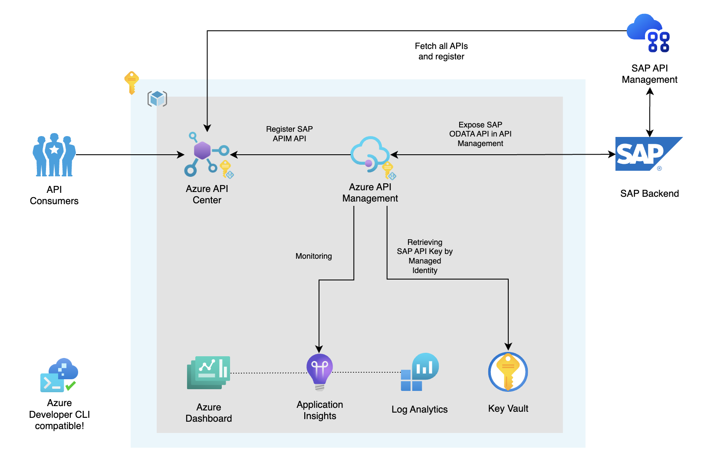
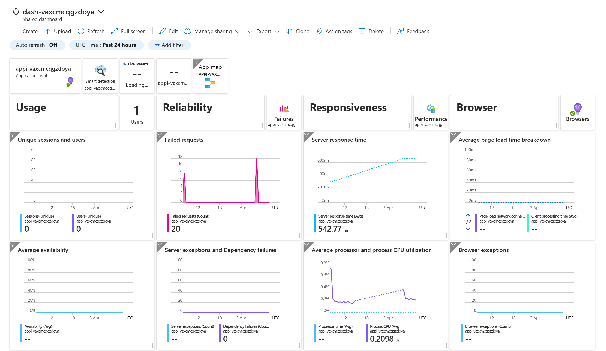

<!-- YAML front-matter schema: https://review.learn.microsoft.com/en-us/help/contribute/samples/process/onboarding?branch=main#supported-metadata-fields-for-readmemd -->

[](https://codespaces.new/azure-samples/azd-apic-sap)
[](https://vscode.dev/redirect?url=vscode://ms-vscode-remote.remote-containers/cloneInVolume?url=https://github.com/azure-samples/azd-apic-sap)

<!--
Available as template on:
[](https://aka.ms/awesome-azd)
`azd`
-->

# Discover your SAP & Azure API Management APIs in one place with Azure API Center

Improve the discoverability and governance of all your APIs in one place, with Azure API Center. In this sample we expose SAP APIs directly and Azure API Management APIs connected to an SAP ODATA backend to API Center, deployed with Azure Developer CLI (`azd`).

This repository provides guidance and tools for organizations looking to implement Azure API Center to improve the discoverability and governance of all APIs in one place. The repository includes a Bicep template for provisioning and deploying the resources, and a sample API implementation that demonstrates how to expose SAP APIs directly and Azure API Management APIs connected to an SAP ODATA backend to API Center.

## Key features

- **Infrastructure-as-code**: Bicep templates for provisioning and deploying the resources.
- **API Inventory**: Register all of your organization's APIs for inclusion in a centralized inventory.
- **API Covernance**: Organize and filter APIs and related resources using built-in and custom metadata properties, to help with API governance and discovery by API consumers. Set up linting and analysis to enforce API definition quality.
- **API Discovery**: Enable developers and API program managers to discover APIs via the Azure portal, an API Center portal, and developer tools including a Visual Studio Code extension integrated with GitHub Copilot.
- **SAP Integration**: Expose your SAP backend via Azure API Management or via SAP API Management to Azure API Center.
- **End-to-end sample**: Including dashboards, sample APIs and Developer Portals.

## Architecture


Read more: [Architecture in detail](#architecture-in-detail)

## Assets

- Infrastructure-as-code (IaC) Bicep files under the `infra` folder that demonstrate how to provision resources and setup resource tagging for azd.
- A [dev container](https://containers.dev) configuration file under the `.devcontainer` directory that installs infrastructure tooling by default. This can be readily used to create cloud-hosted developer environments such as [GitHub Codespaces](https://aka.ms/codespaces) or a local environment via a [VSCode DevContainer](https://code.visualstudio.com/docs/devcontainers/containers).
- Continuous deployment workflows for CI providers such as GitHub Actions under the `.github` directory, and Azure Pipelines under the `.azdo` directory that work for most use-cases.

## Getting started

### Prerequisites

- [Azure Developer CLI](https://docs.microsoft.com/en-us/azure/developer/azure-developer-cli/)
- An SAP Environment. See below on how to setup your own SAP OData API. 

### SAP OData API

You can setup SAP OData API in minutes. You need to signup and then you can tryout the API [here](https://api.sap.com/api/API_BUSINESS_PARTNER/tryout). You'll find the API documentation [here](https://api.sap.com/api/API_BUSINESS_PARTNER/overview).

If you used the SAP Sandbox environment as mentioned above, the SAP_ENDPOINT is https://sandbox.api.sap.com/s4hanacloud/sap/opu/odata/sap/API_BUSINESS_PARTNER. The SAP_APIKEY can be found in the SAP API Business Hub.

OData API type just got into public preview. You can find more information about how you can add your own SAP OData APIs in Azure API Management [here](https://learn.microsoft.com/en-us/azure/api-management/sap-api?tabs=odata).

### 1. Initialize a new `azd` environment

```shell
azd init -t azure-samples/azd-apic-sap
```

If you already cloned this repository to your local machine or run from a Dev Container or GitHub Codespaces you can run the following command from the root folder.

```shell
azd init
```

It will prompt you to provide a name that will later be used in the name of the deployed resources. If you're not logged into Azure, it will also prompt you to first login.

```shell
azd auth login
```

### 2. Provision and deploy all the resources

```shell
azd up
```

It will prompt you to login, pick a subscription, and provide a location (like "eastus"). We've added extra conditional parameters to optionally deploy: ...

For more details on the deployed services, see [additional details](#additional-details) below.

The conditional parameters set in the `azd up` command are stored in the .azure\<name>\config.json file:

```json
{
  "infra": {
    "parameters": {
      "deployAzureAPIMtoAPIC": "<true or false>", // Deploy Azure API Management APIs to API Center
      "deploySapAPIMtoAPIC": "<true or false>", // Deploy SAP API Management APIs to API Center
      "sapBackendEndpoint": "<the SAP OData endpoint for API Management>", // The SAP OData endpoint for Azure API Management
      "sapBackendApiKey": "<the SAP OData api key for API Management>", // The SAP OData api key for API Azure Management
      "sapApimTokenUrl": "<the SAP API Management token URL>", // The SAP API Management token URL
      "sapApimDiscoveryUrl": "<the SAP API Management discovery URL>", // The SAP API Management discovery URL
      "sapApimClientId": "<the SAP API Management client ID>", // The SAP API Management client ID
      "sapApimSecret": "<the SAP API Management secret>" // The SAP API Management secret
    }
  }
}
```

> [!NOTE]  
> When you only want to deploy the SAP API Management APIs to API Center, but not the Azure API Management APIs, you can set the `deployAzureAPIMtoAPIC` parameter to `false`. All input related to Azure API Management will be ignored. Same applies for the `deploySapAPIMtoAPIC` parameter for the SAP API Management APIs.

## Additional features

### CI/CD pipeline

This project includes a Github workflow and a Azure DevOps Pipeline for deploying the resources to Azure on every push to main. That workflow requires several Azure-related authentication secrets to be stored as Github action secrets. To set that up, run:

```shell
azd pipeline config
```

### Enable AZD support for ADE (Azure Development Environment)

You can configure `azd` to provision and deploy resources to your deployment environments using standard commands such as `azd up` or `azd provision`. When `platform.type` is set to devcenter, all `azd` remote environment state and provisioning uses dev center components. `azd` uses one of the infrastructure templates defined in your dev center catalog for resource provisioning. In this configuration, the infra folder in your local templates isn’t used.

```shell
 azd config set platform.type devcenter
```

### Monitoring

The deployed resources include a Log Analytics workspace with an Application Insights based dashboard to measure metrics like server response time and failed requests. We also included some custom visuals in the dashboard to visualize the token usage per consumer of the Azure OpenAI service.



To open that dashboard, run this command once you've deployed:

```shell
azd monitor --overview
```

### Clean up

To clean up all the resources you've created and purge the soft-deletes, simply run:

```shell
azd down --force --purge
```

The resource group and all the resources will be deleted and you'll not be prompted if you want the soft-deletes to be purged.

### Testing

A [tests.http](tests.http) file with relevant tests you can perform is included, to check if your Azure API Management deployment is successful with the SAP Backend. I've added my test script for testing the SAP API Management Discovery as well in this file: [sap-apim-scan.http](sap-apim-scan.http). You can easily complete the parameters in the tests file, just check the environment variables in the `.env` file, or run the command below in the terminal. Keep in mind that secrets are not stored in the `.env` file, so you need to provide them manually.

```shell
azd env get-values
```

### Build Status 

After forking this repo, you can use this GitHub Action to enable CI/CD for your fork. Just adjust the README in your fork to point to your own GitHub repo.

| GitHub Action | Status |
| ----------- | ----------- |
| `azd` Deploy | [](https://github.com/azure-samples/azd-apic-sap/actions/workflows/azure-dev.yml) |

## Additional Details

The following section examines different concepts that help tie in application and infrastructure.

### Architecture in detail

This repository illustrates how to deploy a solution that integrates SAP APIs and Azure API Management APIs into Azure API Center.

We've used the Azure Developer CLI Bicep Starter template to create this repository. With `azd` you can create a new repository with a fully functional CI/CD pipeline in minutes. You can find more information about `azd` [here](https://learn.microsoft.com/en-us/azure/developer/azure-developer-cli/).

One of the key points of `azd` templates is that we can implement best practices together with our solution when it comes to security, network isolation, monitoring, etc. Users are free to define their own best practices for their dev teams & organization, so all deployments are followed by the same standards.

When it comes to security, there are recommendations mentioned for securing your Azure API Management instance. For example, with the use of Front Door or Application Gateway (see [this](https://github.com/pascalvanderheiden/ais-sync-pattern-la-std-vnet) repository), proving Layer 7 protection and WAF capabilities, and by implementing OAuth authentication on the API Management instance. How to implement OAuth authentication on API Management (see [here](https://github.com/pascalvanderheiden/ais-apim-oauth-flow) repository).

### Azure API Center

[Azure API Center](https://learn.microsoft.com/en-us/azure/api-center/overview) is a service that provides a centralized inventory of all your organization's APIs. It allows you to organize and filter APIs and related resources using built-in and custom metadata properties, to help with API governance and discovery by API consumers.

### Azure API Management

[Azure API Management](https://azure.microsoft.com/en-us/services/api-management/) is a fully managed service that enables customers to publish, secure, transform, maintain, and monitor APIs. It is a great way to expose your APIs to the outside world in a secure and manageable way.

### Application Insights

[Application Insights](https://azure.microsoft.com/en-us/services/monitor/) allows you to monitor your application. You can use this to monitor the performance of your application.

### Log Analytics

[Log Analytics](https://azure.microsoft.com/en-us/services/monitor/) allows you to collect and analyze telemetry data from your application. You can use this to monitor the performance of your application.

### Azure Monitor

[Azure Monitor](https://azure.microsoft.com/en-us/services/monitor/) allows you to monitor the performance of your application. You can use this to monitor the performance of your application.

### Azure Key Vault

[Azure Key Vault](https://azure.microsoft.com/en-us/services/key-vault/) allows you to store and manage your application's secrets. You can use this to store your application's secrets.